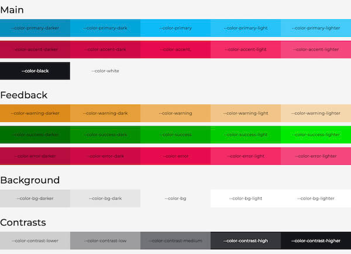
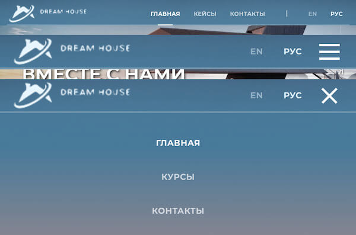
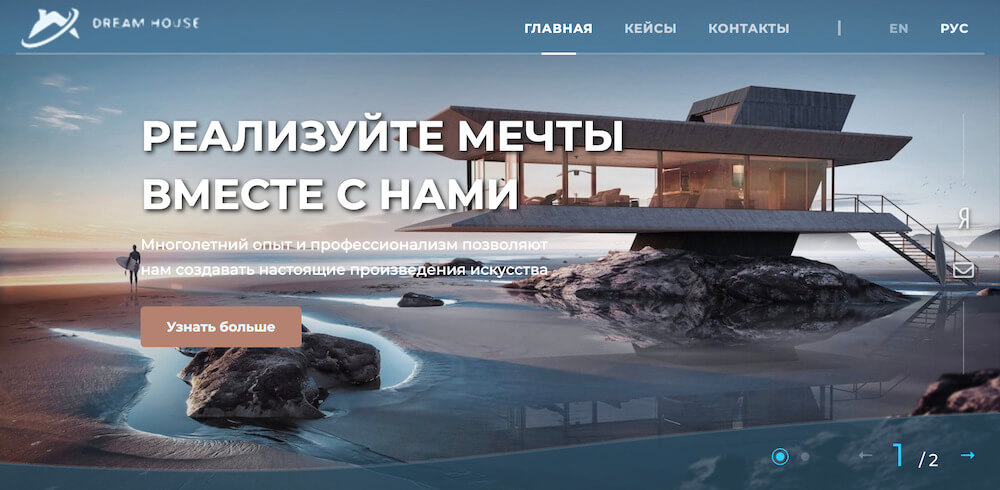
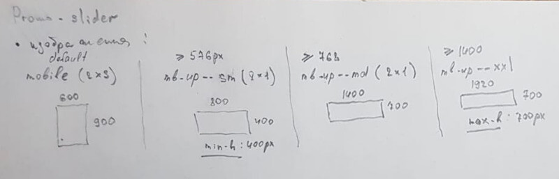
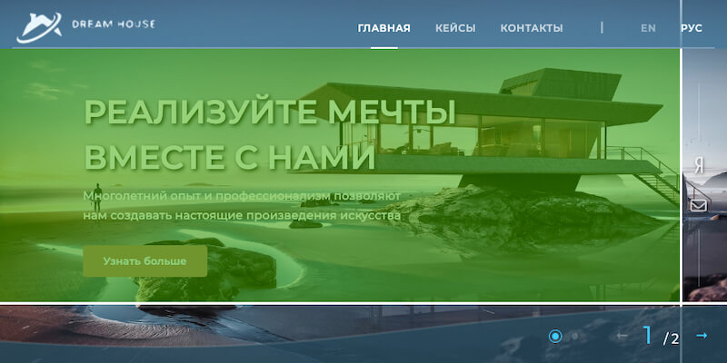
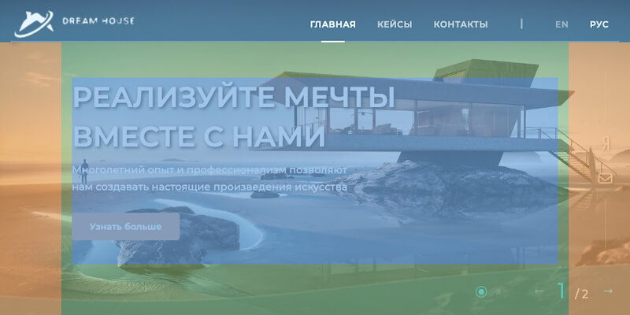

# Разработка сайта по маркетингу

#### Этапы


- [ ] [Инициализация проекта](#initialize)
	- [ ] [Инициализация шаблона `OptimizedHTML5`](#initialize-oh5)
	- [ ] [Инициализация проекта (стили, шрифты,...)](#initialize-project)
- [ ] [Вёрстка](#frontend)
	- [ ] [Header](#frontend-header)
	- [ ] [Slider-home](#frontend-slider-home)


<br>
<br>
<br>
<br>
<br>
<br>
<br>

<!----><a name="initialize"></a>
## 0. Инициализация
<!----><a name="initialize-oh5"></a>
#### 0.1. Клонирование шаблона [OptimezedHtml5](https://github.com/agragregra/oh5)

* Клонируем
```Bash
git clone https://github.com/agragregra/oh5;
cd oh5;
rm -rf trunk .gitignore readme.md .git;
cd ../;
mv oh5 marketing
```
* Установка
```Bash
ncu -u; npm i; ncu; gulp
```

* Публикуем на github
```Bash
echo '/**/node_modules/ \n/.git/ \n/package-lock.json \n/**/Thumbs.db \n/**/*.DS_Store \n/**/package-lock.json /\n/**/debug.log' > .gitignore;
git init;
git add -A;
git commit -m "0.0. Initialize OptimiseHtml5";
git remote add origin git@github.com:Sania2991/marketing.git
git push -u origin master
```

<br>

<!----><a name="initialize-project"></a>
#### 0.2. Настройка проекта - [commit](https://github.com/Sania2991/marketing/commit/1204d17ab58cf8334c1cb57f545477586e9bcc28)

##### Подключение стилей в `main.sass`
```sass
@use 'sass:math'
@use 'sass:color'

@import theme-colors
@import config
@import components
@import 'helpers/**/*'
@import 'blocks/**/*'
```

##### Подключаем шрифты, размеры, переменные в `_config.sass`

<br>

##### 0.2.3. Цветовая схема `_theme-colors.sass`


* **Определяем цвета:**
```SASS
// main
$color-primary: #08bbf7		// цвет действия, основной цвет для ссылок, фона кнопок и т.п.
$color-accent: #e70d4f		// для выделения чего-то важного на странице 
// black + white
$color-black: #14151a
$color-white: #fff
// feedback  -  цвета для обратной связи с пользователем
$color-success: #00ad00
$color-error: #e70d4f
$color-warning: #edb464
// bg + contrasts
$color-bg: #f4f4f4		// фоновые цвета
$color-contrast: #14151a	// шрифтов, рамок, теней и т. п., обычно шкала серого тона
```
* **Подставляем цвета в [редактор](https://codyhouse.co/ds/globals/colors)**
	*	копируем код (изменяем под SASS, не забыть исправить пробелы на `tab`)
	* если тёмная тема не нужна  -  удаляем стили
	* тестируем - запускаем файл: `tests/theme-colors.html`

* **ВАЖНО**
	* в стилях для прозрачности, используем функцию alpha:
```sass
background-color: alpha(var(--color-primary), 0.2)
```


<br>

___

<!----><a name="frontend"></a>
## 1. Вёрстка

<!----><a name="frontend-header"></a>
#### 1.1. Frontend__Header - [commit](https://github.com/Sania2991/marketing/commit/6b33e6b4dda86874b9e4236eb36e17a04d67c051)


**Header-меню** имеет следующее поведение: сначала распологается сверху (absolute), а при прокрутке до "наблюдателей", добавляются:
* page-header--sticky  -  фиксирует меню
* page-header--sticky-show  -  появляется

**Hamburger** делает задержку в 300ms для красоты: отработывается анимация => затем появляется мобильное меню.

**Наблюдатели** чтобы не нагружать работу браузера, используется IntersectionObserver
```HTML
<div class="js-observe" data-observe-element="page-header" data-observe-add-class="page-header--sticky"></div>
```
* **js-observe**:  наблюдатель, на который мы нацелены.
* **data-observe-element**:  если указан - будет добавлен класс для указанного элемента, иначе для самого наблюдателя.
* **data-observe-add-class**:  если указан - добавляется класс, когда "наблюдатель" скрылся
* **data-observe-remove-class**: если указан - удаляется класс, когда "наблюдатель" скрылся

<br>

<!----><a name="frontend-slider-home"></a>
#### 1.2. Frontend__Slider-home


##### Ресурсы:
* [SwiperJS](https://swiperjs.com/swiper-api#pagination) - оф. сайт
* [WebDesignMaster](https://youtu.be/3PzzZ5eHHig) - подробный разбор работы SwiperJS

<br>

##### Плагины:
* **SwiperJS** { Swiper, EffectFade, Navigation, Parallax, Pagination, Controller }
* **GSap** { Power2 }  -  анимация цифры текущего номера слайда

<br>

##### Разработка:

###### Изображения:


Изображения имеют **2** варианта и **4** размера:
* **default** - 600 x 900px (2:3)
* **mb-up--sm** - 800 x 400px (2:1), установлено `min-height: 400px`
* **mb-up--md** - 1400 x 700px (2:1)
* **mb-up--xxl** - 1920 x 700px (2:1), установлено `max-height: 700px`
<br>

###### Обрезка изображения:
* `.slider-overay` - обрезает изображение с помощью SVG
	* [svg-art.ru](https://svg-art.ru/?p=1114) - здесь можно настроить координаты кривой для SVG

<br>

###### Особенности:



* **Область взаимодействия (перелистывание)** со слайдом выделена зелёным цветом.
* **Область текста** выделена синим цветом. Размеры всего слайда зависят от `.slider-img (relative)`, поэтому **ВАЖНО СЛЕДИТЬ**, чтобы текст не выходил за границы.